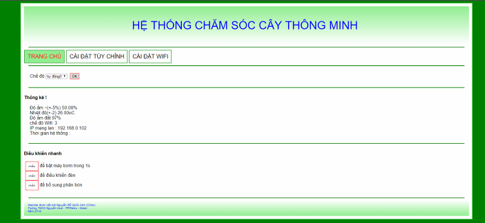

## The beginning journey to the future Vietnam Science and Engineering Fair (ViSEF)

After I learn programming Arduino and toy cars for months. I decided to make a project for a competition at my mid-school Nguyen Hue. At this time, I had Mr. To Nam, who taught me IT subject and he saw my potential.

At this time, I learned about web programming and used it to control the ESP8266 remotely. The time I controlled a LED over Wi-Fi and a computer was really interesting. 

At school, because other kids just made too simple things, I moved to the local town SEF the next year with the same product (thank you to the invitation of my teacher, I had never heard of any science fair in my town). With some upgrades.

FYI, there are some violations and scandals about ViSEF, but as I live in a small town, well, I don’t have a choice. After all these years joining this fair, I don’t have any significant results to directly benefit my chosen university in the future. After 2 years of joining ViSEF, the highest prize I got is consolation or 4th prize.

## Featured with many features in… 2 files

As a self-learner, nobody told me the better way to code, so I had to figure that out later myself. But this time, I got two microcontrollers. Each had a single file of code (sure I knew how to use other libraries to connect with different modules like External ROM, RTC…). Using an Arduino Pro Mini and an ESP8266 V2 (at this time I didn’t know that the ESP8266 had external pins too and I didn’t need to have a separate Arduino).

But it was really funny to see HTML, CSS, and JavaScript in a C++ file and in a string format. Thank you to me, I made the debug process extremely painful. Somehow, I managed to allow the user to change the wifi setting too.

If you are curious about how hilarious the code seems, check out my code [here](https://github.com/Cemu0/smart-box-for-tree/tree/master)

## It took me a week to fix a character bug “+” sign

Sure, it was always hard when you started. I don’t remember the details, but I got a bug when setting the system for automatic watering. At 5 a.m. in the morning, the system kept pumping water to the tree and kept doing it until water was all over my floor and table. Luckily, the system was still fine because it was inside a box and I did not have a backup version. 

## Conclusion 
Besides the fact that this kind of project usually ends up in some conner. But It helps me to learn different skills that are still in use nowadays, from the network infrastructure to web programming. And since I read almost all post in Vietnamese 
And most importantly, it taught me to teach my students to do the same idea. 
