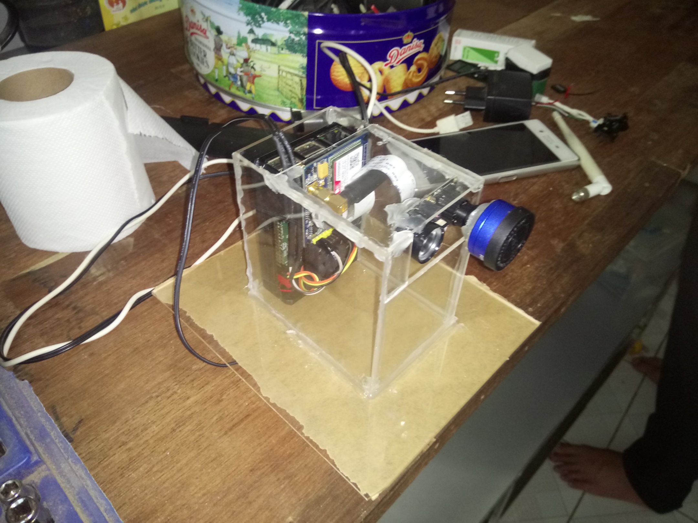
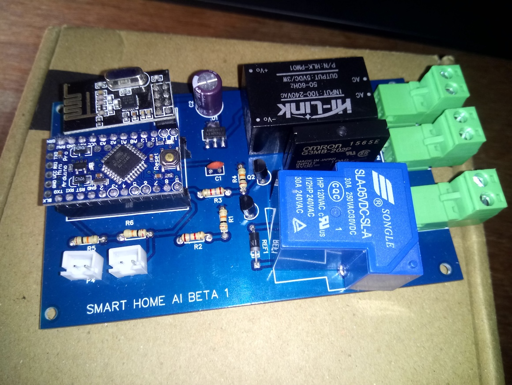

## Begin at a normal high school
The result from last year's fair made me willing to do something even more challenging. So I jumped in headfirst on started this project before I moved on to high school. One of the reasons I learn in normal school instead of gifted school is because… I play too much in the summer and have a month of vacation in Ha Noi, and for any student to join the gifted school, they need to put in a ton of extra hours with classes, and for me, I'd barely done any. 

The previous fair also allowed me to know a new friend, Huy and a new teacher in the high school Mrs. To Lan, she is an Infomation Technology teacher. So I gathered my friends and asked my teacher for some help to prepare for the next competition. 
Our strategy is an idea that can benefit the old, decided to make a camera system that can call in emergency cases like when someone falls on the floor. For the call part, that is a piece of cake, just bought a SIM module and hooked up to the UART port on the Raspberry Pi and you can make a call or text msg in just a few hours. But for the AI part, detecting someone falling on the floor using the camera was not simple, and quite a new concept to that day.
To be honest AI at this time is the very beginning of the blooming stage, TensorFlow is one of the biggest machine learning platforms, and there is a post by Google on how to train your own model. So I went on to try that out. 

*An acrylic box with hot glue gets the job done*

I also make some PCB for smart home control using hand gestures, like if the person falls it can... turn on the light. Or just in case AI is too hard, we are going to make an IOT project.

## Collecting Data for the first time
At this point for an AI model to run, you need thousands of images about the target you want the model to detect, and to detect a fall person, using an existing human detect model is not viable because the body shape is not the same (I tried to detect using the shape of the detected bounding box, if the rectangle stays vertical mean they… lying and when they lying on the floor, they probably fell. Another idea is to force the model to detect human video feed with 90 degrees rotation, but it wasn't reliable) 

So I and Huy went on to DIY the "lying person dataset", by actually lying on the floor, we had some friends to help us with that. I also gathered data manually from the internet, by searching the related content (major of them are accident images, and some image about the old fall is faked) As it is our first time on ML, we have many to learn. We also attempt to collect hand data for gesture control (like, if you have fallen on the floor, and might want to cancel the emergency call by raising a hand. Quite a silly idea)

## Train the model until my first PC motherboard is dead.
Long story short, collecting data was an easy part, training it is harder. Thank my mom for buying me a PC recently at that time, I only built the PC with an Intel-core chip, no GPU, since I had only intended to compile code before and didn’t have any plan for playing games. So no GPU, training AI on a CPU is like hell. I tried to train on CPU and… Google Cloud (I got free 300$ for trying the service, but no permit to use GPU… So yeah, I trained on Google Cloud CPU, and after a week of training, the handmade AI model was unable to recognise me lying on the floor, and unable to achieve a decent score in validation data. At this time, several months have passed and our project is on the edge of failure. 

My friend Huy, who's the same age as me, was making waves at the time, he had been working with a phone repair shop. He'd managed to buy a GTX1060 with 6GB RAM. He let me borrow it for our project, so with the card on, I quickly went into training the model and got a better result after a week. On testing, the new model showed a little capability of actually detect lying person, with a little shake on our body on the floor. With this result, we went on the competition with a little more confidence. The electric bill that month went up significantly too :D. 

But, I didn't know that the power supply of my PC was not good. After weeks of training and improvement. My PC is suddenly dead while training the model, leaving us freaking out. Luckily, the shop accepted the warranty and replaced us with a new motherboard. And at least we got even better results for our model. 

## The local fair
This year, our school will host the fair, so it is a little advantage for us in term of travel distance. I am quite familiar with the format of the fair by my experience on it last year, and we got in the final round. 
At the final round, we presented our project in front of the congress. There is an older brother competitor, he has the same project purpose. Instead of using the camera, he made a wristband that was capable of detecting falls. So it is similar to the feature later Apple Watch had, and in my point of view, it would be more capable in terms of actually solving the problem. However, when the examiner asked to compare our projects he instead emphasised the advantages of my project like more accuracy and reliability, and at the end gave me a ticket to go on ViSEF, a national competition. Honestly, I feel my project sometimes like trying to use a cannon to kill chickens and promote the project using fancy technology like AI and Machine Learning. 

*Mrs. Lan, Mr. Huy and me prepare for the presentation*
# A trip to Da Lat
ViSEF this year is held at Da Lat, and we have a trip there with our local best teams. When the first examiner came to our poster to see the demo, my friend, Huy lying on the floor to demonstrate the features of our project, it was detected that he lying on the floor and demo quite smoothly. Later on, when the sunlight direction in the afternoon changed, we failed the demo with another examiner. But we still have hope and wait for the final event. But after all our attempts in the whole year, we back home with no prize. We were both sad and really disappointed at this point after all our efforts.
But for me, I moved on with a new attempt just several days later. I met a new teacher, Mr Hoanh, a Physics teacher at my high school and we heavily brainstormed for our next year's project.

[Old Code Repo and model in 2018](https://github.com/Cemu0/fallpesondetection)
