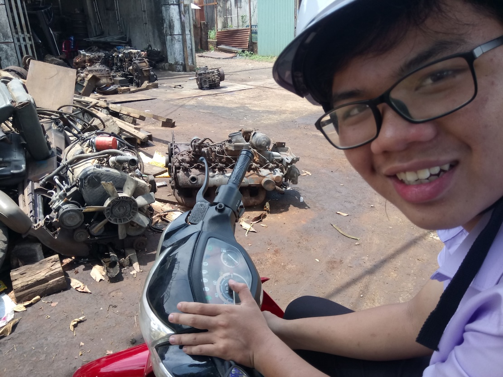
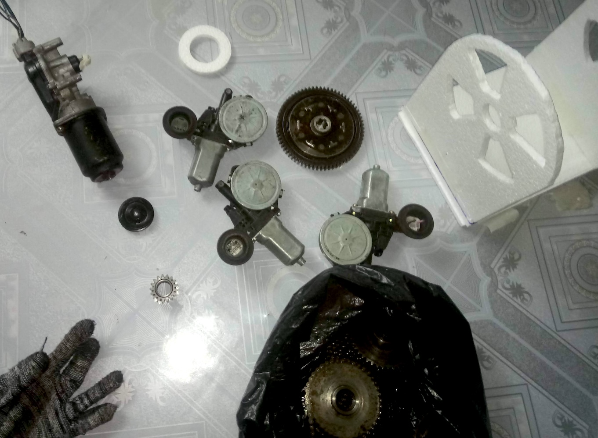
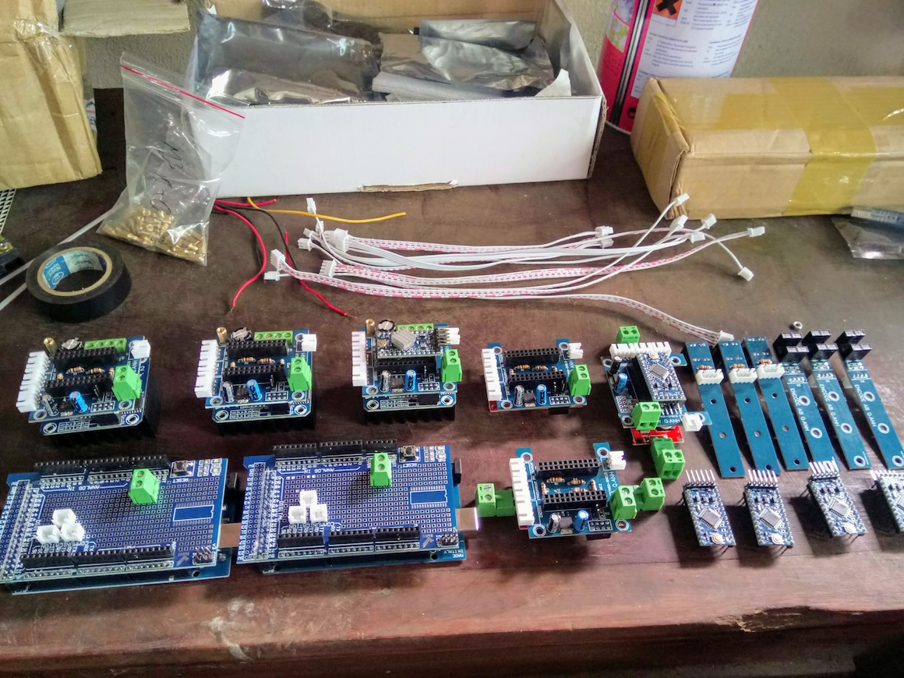
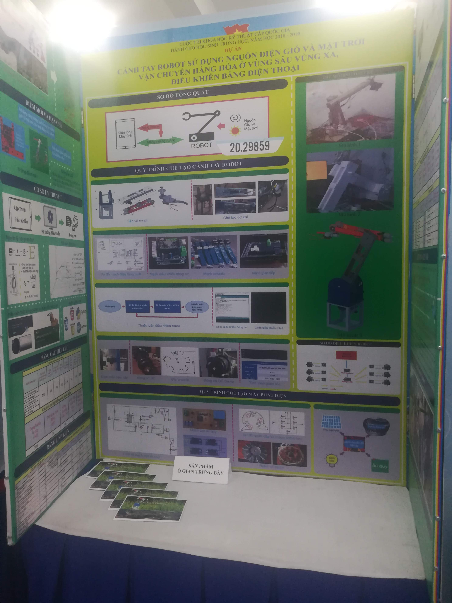

## Brainstorm
My new teacher Mr Hoanh, discussed with me and Huy for a week we decided to move on and make a giant robotic arm. To achieve that, we would use a prototype process. In detail, first I made the small robot arm with whatever I had.

Here I use carton papers and some electronic motor pieces from several AC voltage stabilizers that are malfunctioning to make a moveable electronic-controlled robot arm (more like a kid's DIY toys).

 

## Assemble the robot from the waste
We drive around the city, looking for parts that we could utilize in our future robot. At first, Huy helped me to drive around the city. But unfortunately, at this point, he cannot continue with the project. So I and my teacher continued with the ambiguous target, the giant robot arm. At this point, we also collected many motors that came from old cars, I found them in some wastelands far away from the town, they disassembled old vehicles and sold those parts as replacements for anyone who need. Or sometimes, I just collect those parts, from the wastelands and they sell it to me in weight. 

 
After collecting many parts, I chose some decent parts and drew CAD, as I knew working on a large scale is not simple because it just has too many parts to calculate and for drawing I use Creo. From the collected motor, I also need to measure the potential torque force each motor can provide under 12V.  

Using car’s used DC motors is cost-saving, But it comes with another cost, the replacement part or the motor itself is hard to find, so if any motor breaks down, it is a huge risk. But I want something big and cheap so there are not many other options from the wasteland. DC motors are more friendly for driving too, but in the long term, the brushes will wear out. I love using the advanced BLDC motor as it provides more control and challenges to control it. Or just use a Stepper motor like other people. 

 
From the torque calculation, I continue to calculate and change the final robot size, the final design is also really important. I don't want to make a robot that cannot move. And as the robot is large, steel is the only viable option for making the robot. (at this point I know about 3D printing but I think it is too risky in terms of time, and plastic is not as... industrial look as steel frame)

 
From the calculation, I draft everything on CAD and make the Styrofoam model in real scale of the robot arm. Also for people who help me to build this big robot to understand what I want to do. Thanks again to my teacher for driving me around the town looking for a shop that CNC the big parts for the base of the robot. The base is made from a 1 cm thick plate of iron. The arm body is made from a steel-shaped U. 

 
And sure, at a high-school age, I was not confident in using many dangerous tools like agon gas iron cutting or stick welding. Thanks to my Uncle Minh, who helped me with those heavy parts. He also helps me to contact a lathe engineer to make connections from the motor to the gears of the robot. 

Talk about the gears. It's not custom, all just waste from motorbikes hahaha. I also collect those from the wasteland too. Those are the main gear in the motorcycle gearbox and many chainrings and chain parts from the starting system of the motorbike.

## Electronic 
Before this point, I also learned to make PCB manually but it was just too ugly and not reliable. Also when choosing the motor, I measured the current and bought several motor drives for the test. After careful selection and testing. I went on to design a PCB for the most optimistic driver. I called my PCB the sheld for the driver board. And on that board, I use Arduino Micro for the main controller. As I was not confident in SMD soldering at the time. I also design an encoder PCB for speed and position control of each motor later on. 

 
Things are quite straightforward at this point. I don't have any major issues or challenges yet. The PCB and parts arrive, I test one of them, then solder all. Designing an acrylic box for those PCBs was easy too. But I don't like the shop with laser-cut acrylic plates, they calculate the price based on feeling. 

 
## Coding time but math first
But new things always have challenges to come, robotic arms usually have matrices and advanced mathematic calculations for robot control. Forward kinematics was quite straightforward, you have a joint angle with the robot configuration, and with a little time, any high school student can tell the coordinates of any part of the robot.
But for inverse kinematics, using high school algebra was not a good solution, and I am not that smart in mathematics. But if I use an advanced already solved solution and precooked math, how can I explain it to the examiner? So for the whole month, I have tried to solve the inverse kinematics using high school geometry math. 

After many times rechecking the math, I went on calculate and test the math using invert and forward unit tests on Python. I managed to accept the math result and move to control the robot using my math. And yes it took another week to ensure that the code and the robot were running correctly. 

 
So I went on making a UI to control the robot. Interested in Python, I decided to make a Python in-Python control app. This means robot code written in Python will be executed line by line and there will be another Python code to run the environment for the robot system and another Python app to host the web UI control.

 
I had spent a ton of extra hours too, thinking about math and code while studying other subjects in school. Day and night to debug the robot. Many mysterious bugs come after but after all. All those bugs are my mistake. Time and effort fix everything. I manage to control the robot with my devices from Laptop, iPad or Phone using Web control. At this time, WebSocket is not popular, or I don't know about it, so... the only option I have is to use AJAX to communicate between the web browser on user devices. In detail, for real-time communication, using AJAX, The client needs to connect frequently with the server, and the header "Connection: keep-alive" needs to be set to stimulate a continuous connection. Usually, it refreshes every 30 seconds and resents the package, seeking a new update and keeping the connection alive. If there is a new update from the server, the server simply closes the connection and then waits for the client to reconnect and get the new update. All of this is not even my original trick, I learned this trick after inspecting the Messenger app from Facebook to see how the package going :))) 

 

## And ViSEF, again
Quite confident with the robot and with experience last year the local rounds were straightforward. And one more time, I ended up in the ViSEF fair. This time the fair is in Sai Gon, but big is not an advantage anymore, this time, the hall isn't big so my robot is not at the front of the poster and It must be moved to a separate space. And even worse, not all examiners want to see the demo on the real robot. 

 

## But the result
Despite the fact that I, again, working on this project for a full year. I only get 4th prize. With not much make an advantage for my University. This project also marks the end of my journal at ViSEF, as my province said the final class (grade 12) is not recommended to join because they should prepare for the high school graduation exam. My teacher also said maybe the examiner doesn't believe I made this project.

But after all, I got on Television? and PhapLuat news too several days after the fair.

[https://plo.vn/hoc-sinh-che-tao-canh-tay-robot-post517518.html](https://plo.vn/hoc-sinh-che-tao-canh-tay-robot-post517518.html)

But I still went on to make the project the next year anyway.

I also made a presentation video for this project. And it is quite... strange.



[Code Repo](https://github.com/Cemu0/VARM)
