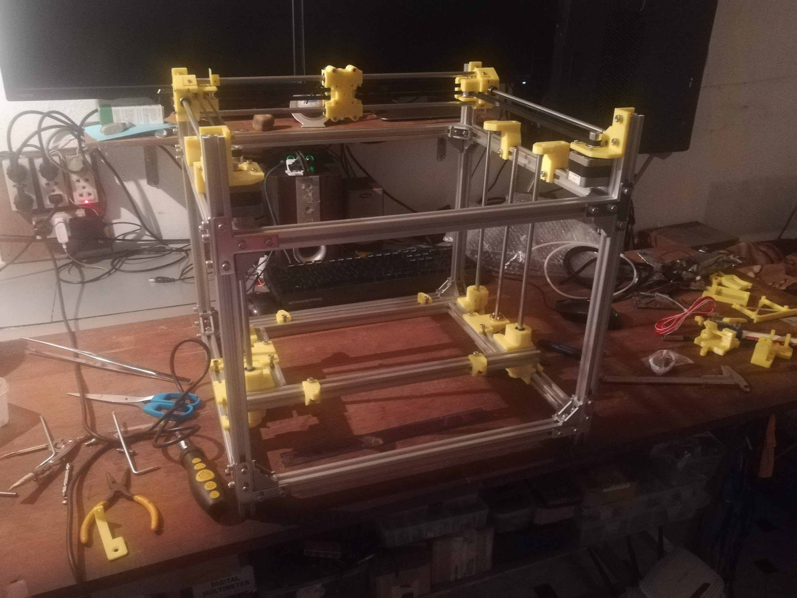

## I have a new competition to join.

After finishing my giant iron robotic arm in 2018, inspired by the idea that my examiner wouldn't believe that I actually made the big robotic arm, I decided to make a smaller one. To support that, I built my own 3D printer (for the cheapest price with a huge volume).

So I ordered parts from a Shopee shop (sorted parts and provided image instructions only). Fortunately, I know English, so I quickly found the origin of the design on Thingiverse. It is the [HyperCube 3D Printer/CNC](https://www.thingiverse.com/thing:1752766) by Tech2C.  

In 2022, I upgraded my 3D printer with OctoPi to print over Wi-Fi. Initially, the UART speed was set at 115200 by default on Marlin software, which affected the printer speed. I remember in many cases it could double the printing time. But after speeding up the baud rate to 500000, the problem was minimal.  

In 2023, my 3D printer became the main tool for prototyping in a startup, and it had multiple parts broken -> PLA degrades after 2 years! Since then, I prefer to use PETG, though the color is not as good.  

I also tried to use ABS, but it usually jumped off the bed. I tried several methods to print bigger parts but failed, including using an AC heated bed for higher and more stable bed temperature. One of the methods I would try in the future is using a heated chamber.  

