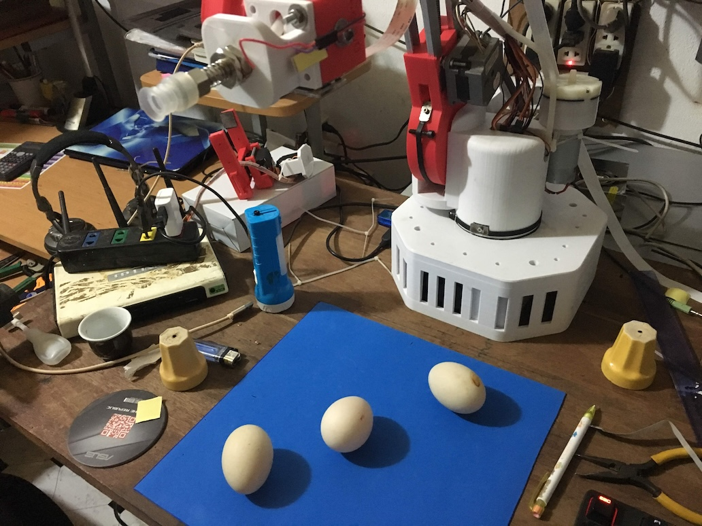



In the summer of this year, after building the 3D printer for making the robot arm, the only thing left was truly building it. Honestly, I admit the 3D printing robot arm is a quite general idea and many students already created this same stuff too. 

My first robot arm is too big and there is room for accuracy improvement. I decided to make a 3D version of the robot. Instead of building from trash, I purchase cheap, used stepper motors. And another RAMPS board from the stepper driver. 

After purchasing enough parts and drafts the robot on the run. I came to CAD the robot body. With 3D printer helps the robot look more professional and I quickly resolve the remaining issues on the prototype. Like, the belt was simply too slippery to grab on the 3D print parts, and I just resolved it by designing a new part that used the belt to grip on the belt itself. The Raspberry Pi was expensive so I reused it from the old robot. Thanks to my uncle Hung, who donated me those Raspberry boards before. Move on to coding, The old code base was quite useable from the last robot so I just developed another fancy computer vision to showcase, and it was fun to see the robot work on itself. There was not much interest in the computer vision part, still OpenCV on a Raspberry Pi board, some simple image processing to split the background and calculate the coordinate for the robot arm to pick up the part.
 

Again the local town competition provided enough money for me to cover the cost of the project, including the cost of the 3D printer. (I had run a campaign to raise money from my mom for this, so for my mom, it was like a high-risk investment with absolutely no revenue)
 

