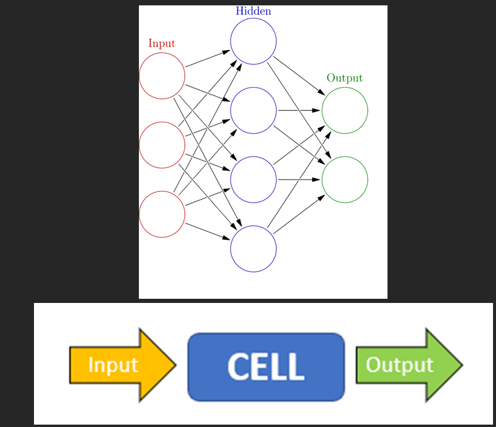
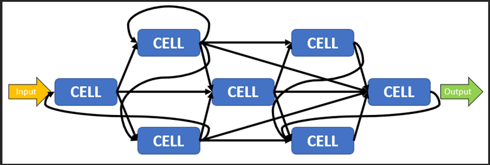

Well, this is the year that I need to prepare for my final high school graduation exam, But I can not give up on making some interesting things and learning some interesting Machine learning, especially math.

So back to the story of 2018, I used an existing Tensorflow library, and modify a bit for the Fall person detection. But I don't want to stop on the application side, I dreamed of making a new, custom algorithm for... fun, or a crazy break though in science... like a superconductor material at room temperature. And for this dream, I started looking for a new idea. And after searching the web for another week, I found this Medium blog post about Neural Networks, because I was deeply passionate about how the deep-learning learns. The post by [Mark Humphries](https://medium.com/the-spike/your-cortex-contains-17-billion-computers-9034e42d34f2), basically, the idea is that the current neural networks system seems to simulate a single neural in a real brain. So I tried to test out this theory by connecting multiple small Neural Networks. 
 

Long story short, it took me weeks to understand some of the math behind the Neural Networks idea, at least I know the real application of the Derivative that our students were forced to solve in high school used for. For the detail idea, I called the current simple Neural Networks cell, so cells connected and predicted the result. But I think ChatGPT will better explain my code than I :D. 

> At its core:  
> 👉 **`cell` is a small neural network module**, like a mini-layer that processes some input and produces an output.  
> Here's the breakdown:
> - `cell` **inherits** from `nn.Module`, so it behaves like any normal PyTorch neural network component.
> - Each `cell` contains **two linear layers**:
>   1. First linear layer: `input -> hidden` (with ReLU activation)
>   2. Second linear layer: `hidden -> output` (with LogSigmoid activation)
> - Weights (`self.weights1`, `self.weights2`) and biases (`self.bias1`, `self.bias2`) are **created manually** using `nn.Parameter` — not with `nn.Linear`, but still trainable by PyTorch.
> - In `forward()`, the `Input`:
>   1. Goes through the first transformation (`Input * weights1 + bias1`) → apply ReLU
>   2. Then through the second transformation (`a * weights2 + bias2`) → apply LogSigmoid
>   3. Finally, output is returned.
> 
> **So basically:**
> - A `cell` = two layers (linear + nonlinearities) packed into a small block.
> 
> ---
> 
> ### In the bigger `NNN` class:
> 
> - **Multiple cells** are connected together based on a **custom structure** (`Connections` matrix) that tells how data flows between cells.
> - Each `cell` takes its **own specific input** and produces output, possibly for other cells to use.
> - **First cell** processes the main input (plus any extra inputs based on connections).
> - **Other cells** process outputs from previous cells.
> 
> > It's like building a **custom dynamic neural network** where each `cell` is a piece of the computation graph, and how they link together is manually controlled.
> 
> ---
> 
> ### Simple mental model:
> - Think of each `cell` as a **processing unit**.
> - `NNN` as a **network of cells** wired according to your `Connections` plan.
> - At each `step`, the outputs flow through the cells again and again (like iterations / updates).

On the day of writing it also gave you an image of the code:

But here are images of my presentation, still some way better, but the ChatGPT did a very good job of explaining things. 
 
 
 
 
So basically the cells are connected in a losing way so that each new interaction, will update the current input of each cell, so it was some kind of LSTM but in a blurier way. Each cell connects to the next closed cells and is separated by layers (for example in 3 layers cells, the input cell won't be connected to the output) 

But the interesting part came from the application of this app. So I use this idea to create a blurry car plate estimation. Trying to solve the problem of blurry images captured by cameras in the city used to detect crimes but they cannot read the plate. So I tried to apply this new algorithm to solve that, after letting it run through the... MNIST dataset, I saw an interesting result that the result, confidence in the output increases each time I pass the data to the model. So I think for the real application, each blurry number image from the camera video feed can be captured and fed to the model. So the result could be the best estimate of multiple images. Also came with potential numbers, so the police can use this estimation to solve the crime.

But the exhaustive part of Machine Learning wasn't the algorithm or optimal it. It was the data part, the better the data, the better the result. But making a good dataset is a real challenge, especially for a new application like this. So I created a small app that will let us capture the plate and track it in the video (as the car or bike was moving) and then separate each number for the algorithm to train and detect in the future.

Then I also make another web app for... demo the algorithm to the judge too. 

This year, the ViSEF only accept the two best teams from the local SEF (science and engineering fair), so no ticket for me, as in the previous two years I already got the ticket. Anyway, I learn quite a bit of research and already had some fun while working with the Machine Learning stuff, and I am doing more in the RAG stuff recently, for example, to validate data or generate the correct format from user data. But I think it will be time before I post this kind of topic again. 

Again, for the source code of the algorithm you can take a look [here](https://github.com/Cemu0/Network-of-Neural-Network/blob/main/core.py)
