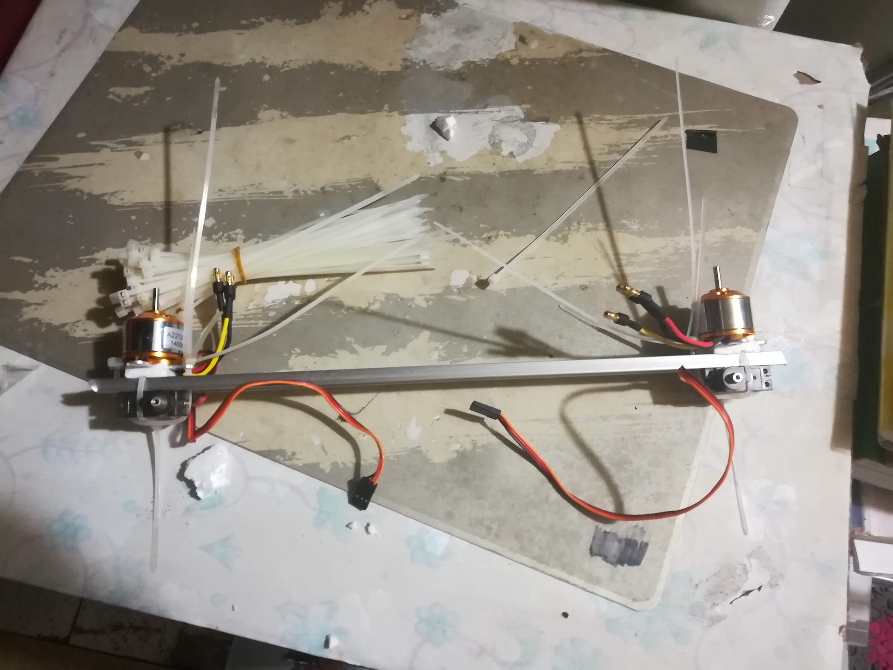
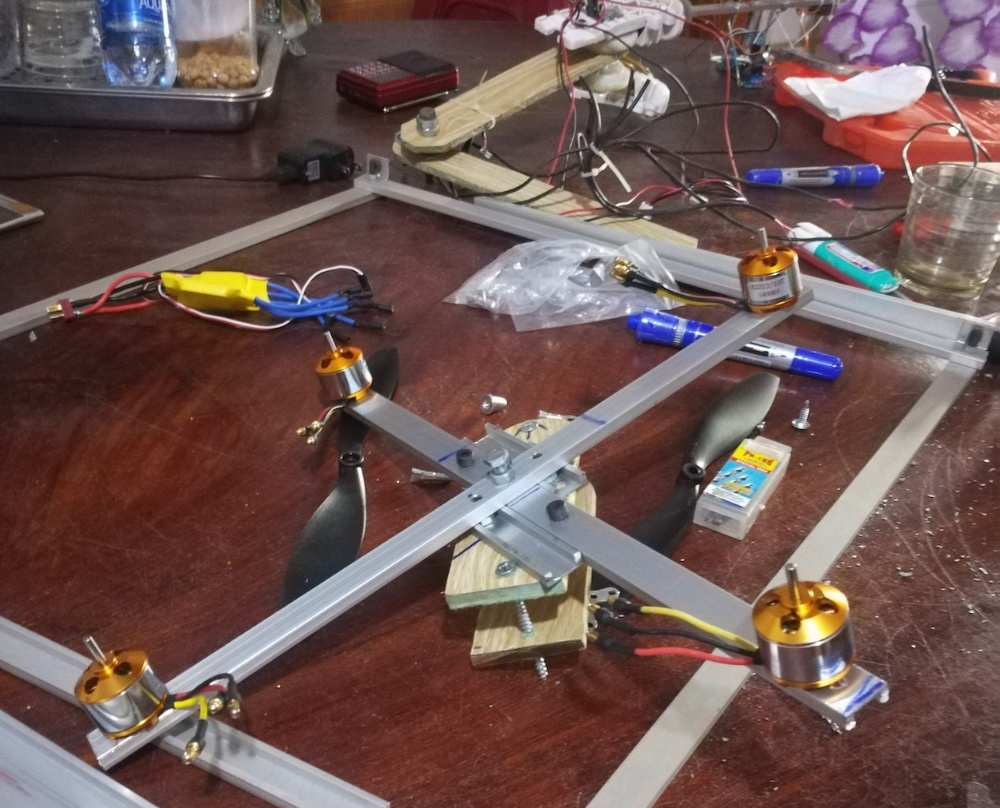
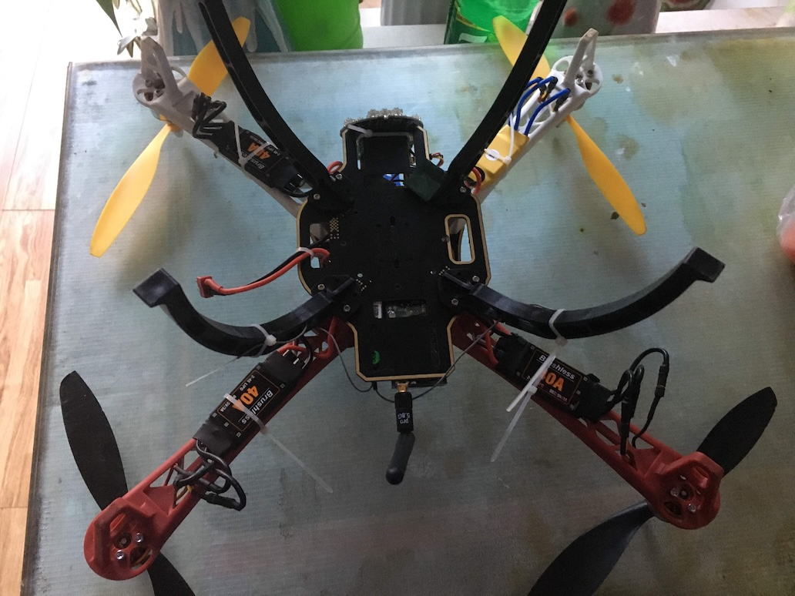
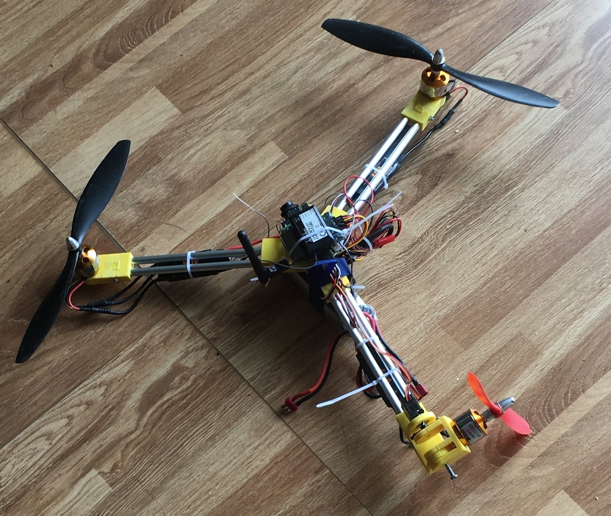
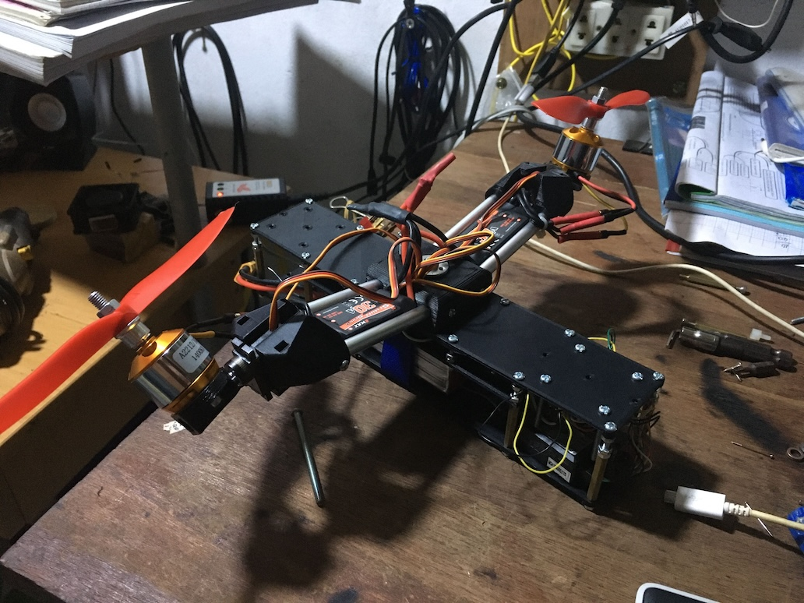



Well, I worked on this kind of project after being quite satisfied with the DIY remote car, and if you ask what time to make those while I was doing other crazy stuff like a robotic arm? I simply spend holidays with this interest. On the other days, Instead of studying like a normal high school student, I will spend the majority of time doing mainstream, fair-related projects so that I can have even more money to make drones, except when I have exams, I spend at maximum one hour per day or non if possible for school work. 

## Year 1 - 2018
Again, I don't want to buy a drone because it seems expensive. And maybe I can handle the PID and flight controller myself. But first, to make things even harder, can I reuse the BLDC motor from the broken HDD disk? Or even better, make my own BLDC controller!

Starting with that ambition, I tinkered with the motors and wrote the driver using the L298 module. But I don't want to copy other smart guys code yet. I went to read about how a 3 phases motor or BLDC motor works and tried to implement that in code. And sure, struggled for a while, but I was able to get the motor to rotate with a little help to spin it up first. YoY with the result, I increase the speed of the motor for fun and quickly burn the motor driver. Well at least before that I also had some fun when spinning up a metal disk inside the HDD with a loose connection, so that when I kicked the disk, it ran around the room like crazy with the momentum it built up before. 

But I know this is far away from actually making a driver I went to sneak the code from many smarts or just copy other smart guys. And I learned that the potential of BLDC is huge. From a highly precise servo motor used in industrial or robotic to longevity application in expensive drills. I also want to make a tripod, as they use the same kind of motor but after many attempts on a burned hot poor HDD driver, I found that the kV value on the low-speed motor needs to be low too. And for lower kV, you need more spooling, more spooling will make the motor harder to make and more expensive. 

 

After several pauses, I come back to the drone track and buy the cheapest drone motors that are suitable. I did try to make some by converting a normal DC motor to a BLDC motor by converting the stator to the rotor and vice versa, but I failed. I also gave up on making my motor driver, after understanding that there were so many tricks and complicated things to make the driver. For example, you need to modify the timer precisely for the motor to rotate more smoothly. Or you would need to read the feedback EMS from the motor for spinup of the motor. 

I think a quad drone would be expensive so, I only bought two motors and used two cheap servos to make a Bicopter drone. I continue to use the Arduino and an MPU6050 as the gyroscope. Long story short, after weeks of trying, turning PID etc, I failed and was only successful in taking off the drone by 20cm in 1s. I ended the first journey by making mistakes and leaving the wind-blade cut my face a little. Luckily, the cut is not deep.

## Year 2 - 2019

Back to the drone, this time with the money from the prize, I bought 4 more motors and drivers, no more complicated moving parts, I planned to make a quadcopter instead. Also, I bought a cheap Flight Controller too, it is a CC3D EVO. So if programming FC is too hard, I would use it as a backup plan. I did spend a ton of time turning the PID in my Arduino code. But, It just barely flies. And I continue to abandon the project for other things.

## Year 3 - 2020
As I expected, balancing the drone in flight by code required more effort or was simply smarter. 
So, I kinda gave up on DYI FC so… let’s just move on to the backup plan. Long story short, it did fly after many turning in the setting of the FC. But the drone flies in a very strange way. It can take off, and balance itself until I rotate it, and the whole drone would just hit hard to the ground. Well, all because previously, one of the motor controllers just died, leaving me no choice but to replace it with a different type of motor controller. The old type is just out of stock. 
 
Realize that problem, I change the drone type, one more time. This time, I made a Tricopter since people advertised it to have a longer fly time, and I have a bunch of servo motors from the previous project. And finally, after so many years, I got my first flight. And well it broke the drone too. I didn't fix it until now. 
 
But during preparation for the High School Graduation test, I went to make the Bicopter one more time, since I saw the video about the Bell Boeing V22 Osprey, it was just so cool, and could potentially even have more fly time than the Tricopter I built, but I just never have enough time for it to take off. 
 
And the story seems to end here. 