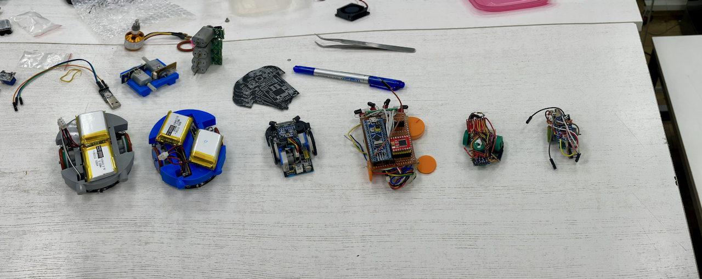
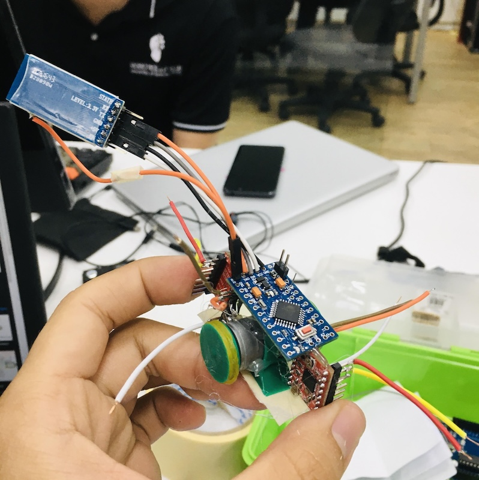
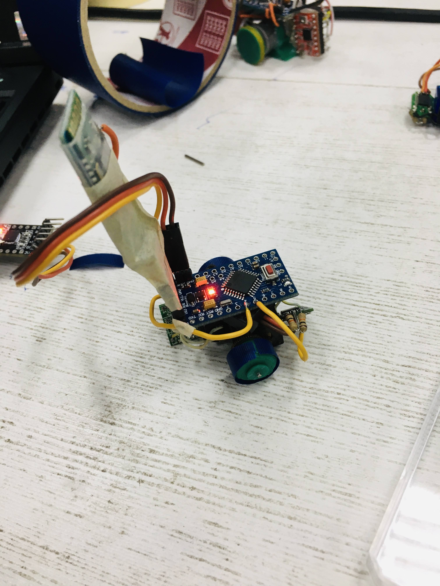
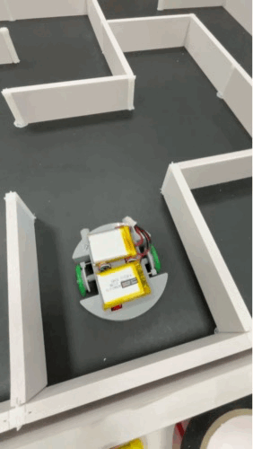

I have been watching YouTube videos about Micromouse for a decade, and thanks to Mr Nam, my Lab Supervisor. He invited me to this research, and, wonderfully, this micro mouse seems to be the smallest in the local area (I mean among the universities in Sai Gon, in 2023)

It has been several years since I started the project, and this is more like a note for me to know what I have tried and should avoid when making another micro mouse.

For the first version, I used available resources in my lab, from a small, cheap stepper motor in the DVD reader to a DC motor in the micro DC-servo. The stepper motor could work, but it is running hot too and melting the hot glue, resulting in a self-disassembled robot. 

In the second version, I modified a cheap servo motor to reuse the gearbox and the small motor in it, which works quite well, except that it is very hard to integrate a decent encoder into this system. I suppose it's still possible if you create a custom PCB for the top of the motor gear; it could be a single-channel encoder, but it would still potentially work if you want to build a small micromouse.

For the third version, I use a pre-built DC gearbox motor with a magnetic encoder. This resulted in a runable robot, but due to the high gearbox ratio, the robot was just too slow.

In the fourth version, I started to customise the robot with a PCB and gearbox, with the motor that was reused from the previous version. Technically, the robot runs quite well, but the cost to make is a bit high and not easy to debug. Small-sized motors can be a bit challenging to find the corresponding gear for the wheel. But after all, it is still workable. The two wheels lead to a problem that the robot finds it a bit hard to move, and it goes with a lot of friction too.

In the fifth version, I use a very cheap motor on the market to make the robot, with a very high-resolution encoder. Also, I use the ESP32 as the main microcontroller, so this results in a workable robot. Allow me to continue expanding the maze and program the robot with previous steps, learning from many blogs and sources, to turning the hardware and mainly making the embedded software. This also has a downside; cheap and big motors bring a bit of weight to the robot and result in a robot that runs with a bit of wobbling, and also the target of making a small robot seems to drift away. 

Unfortunately, after this, the project is temporarily paused due to many personal reasons. In the future version, if possible, I need more time to implement the flood algorithm, and some major hardware issues must be fixed first. I am looking for a way not to use both encoder and gyro but still able to achieve the speed for a speedrun around 1m/s

Design, code and references can be found [here](https://github.com/Cemu0/MicroMouseV4)