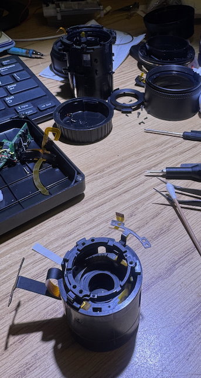
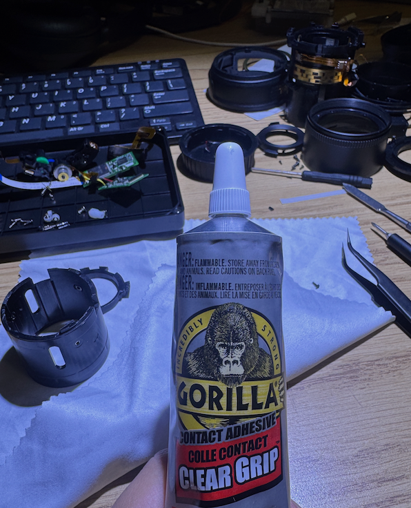
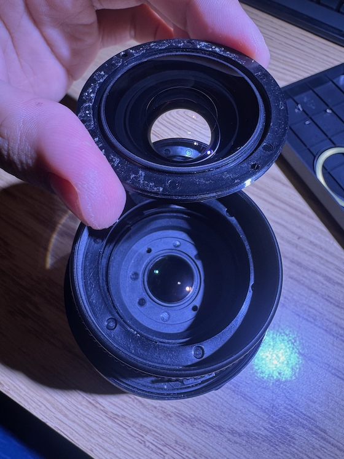
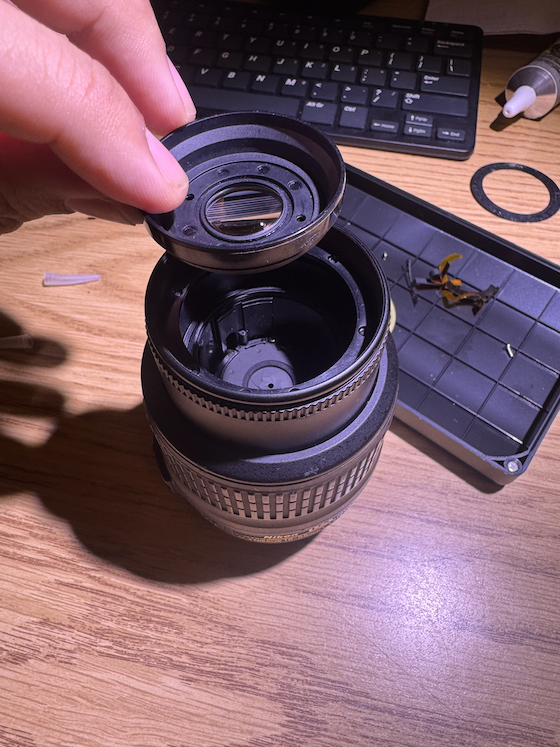

Recently, I bought a cheap, n-th-hand Nikon  D7000 that comes with the lens. After doing time-lapse for several months, I got dust inside the lens. The worst part is that the dust came from the lens kit. Which I found no guide on how to clean inside this part. Because I think no image is better than a bad one for this case, haha (kidding, it's just too much dust to do post-processing removal….). At the end, if you need to clean this part, I found that you might not even need to use a single Phillips screw to clean it…  

When I open the lens, I accidentally cut the FPC cable of the Lens Groups 4-6 cable :( I can reconnect the wire if I have better glue and a microscope, but whatever, it's just the len stabilise cable, so I can simply remove the VR for now :D  

So after wondering for several hours, I decided to tear apart the lens kit using brush force, from behind the lens, this result in the second FPC cable geting cut. I also borrowed my friend’s super glue at night to glue it back again.  

After checking closely with the Lens Groups, I found that I can simply turn the end of the lens and clean it, the gap in this was so small that I thought they used plastic to join these part together. So next time you can simply open the lense from the front and get this one inside clean if needed. A clean room is also required as my room have plenty of dust, but anyway, after assembling the lens, I got it to work better than before and continue on my time-lapse projects.  

## Some guides:  
[Parts of the lens](https://www.repairfaq.org/sam/n1855sps.jpg)  
[PDF guide for opening the len](https://allphotolenses.com/public/files/pdfs/7478c756ef702a1f8245e5ca3b482109.pdf)  